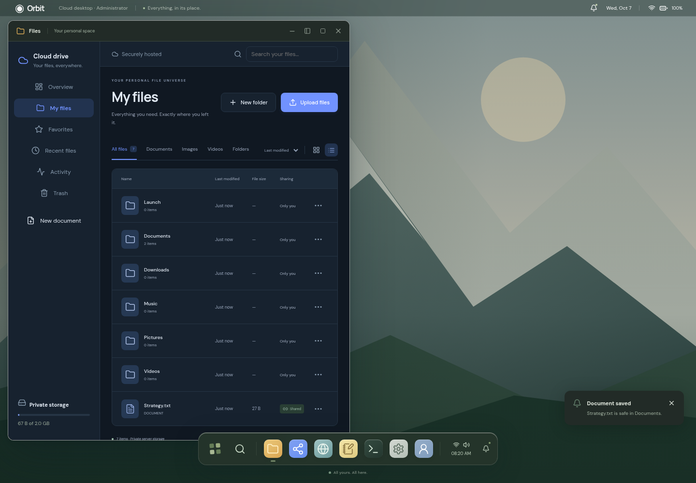
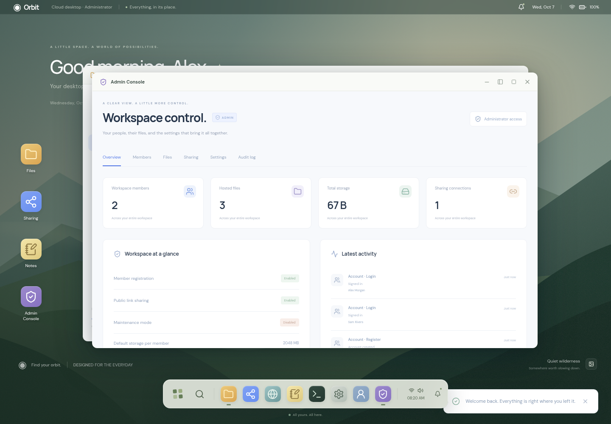
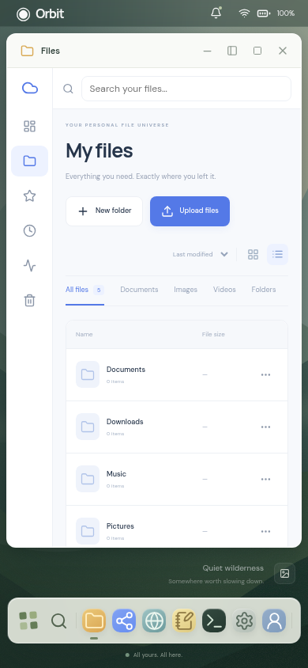

# Orbit Cloud Desktop

A browser-based operating system with a modern desktop, draggable application windows, and a private file-hosting and sharing service. React, TypeScript, and Vite power the desktop; Express, SQLite, and private disk storage power accounts, hosted files, and administration.

**The WebOS desktop is the main experience after login.** Cloud Drive, Sharing, Account, and Admin Console open inside desktop windows. The terminal, editor, and media apps use the same authenticated hosted filesystem as Cloud Drive.

## Screenshots

### Desktop and cloud drive

The WebOS desktop with hosted files, private storage, and sharing in a snapped window.



### Administrator console

Manage workspace members, files, sharing policies, storage limits, and settings from a desktop app.



### Mobile layout

The same desktop and hosted filesystem adapt to smaller screens.



Screenshots use demo accounts and test data.

## What works

- Member registration, member login, separate administrator login, profile changes, and password changes.
- Private server-side file storage, streamed uploads with progress, nested folders, search, sorting, grid/list views, favorites, rename, move, recursive copy, download, and drag-and-drop uploads/moves.
- Text, image, audio, and video previews. Other formats can be downloaded.
- Member-only invitations and public share links with optional passwords, expiry, download limits, download counts, and instant revocation.
- Trash recovery and automatic retention-based permanent deletion.
- Admin overview, member roles, suspension, password resets, individual quotas, file metadata/deletion, share revocation, workspace identity, registration, public-sharing policy, upload limits, extension allowlists, trash retention, maintenance mode, and audit logs.
- Desktop wallpaper, icons, launcher, app/file search, dock, system tray, notifications, quick settings, context menu, light/dark themes, and mobile layout.
- Multiple draggable, resizable windows with focus, minimize, maximize/restore, close, and left/right/full snapping.
- Files, Settings, Terminal, Text Editor, Calculator, Photos, Music, Video, Browser shell, System Monitor, Notes, App Store mockup, Sharing, Account, and role-restricted Admin Console.
- Functional terminal commands work on hosted files. Editor saves persist on the server and immediately update shared downloads. Text editing is limited to 1 MB.
- Device preferences, notes, notifications, window positions, and mock app installations are stored separately for each account in localStorage. Notes and personalization are local to that browser; hosted files are available across devices.

## Run locally

Use **Node.js 24** (Node 22.13+ supports the required SQLite API).

```sh
npm ci
npm run dev
```

Open the Vite URL (normally http://localhost:5173). The API runs on port 3001; Vite proxies `/api` while preserving the request origin. The database, private uploads, and first-run setup token are created in `.orbit/`, which is ignored by Git.

The first screen asks you to create the administrator. Read `.orbit/setup-token` **locally on your server** and enter it into the setup form. Do not share or commit this token. Alternatively, set `ORBIT_SETUP_TOKEN` to your own strong secret before starting the API. After initialization the setup endpoint is disabled. Other members can register only while the administrator leaves registration open.

There are no default accounts or passwords. Tests run with isolated temporary databases and never seed the real workspace.

## Production hosting

**This version needs a full-stack host and persistent disk. Static Vercel/Netlify hosting by itself is insufficient.** A single Node instance serves both the built UI and the API.

### Vercel frontend + persistent Node backend

You can keep the desktop on Vercel while Render (or another persistent Node host) runs accounts, SQLite, and private file storage. Vercel forwards `/api` requests directly to the backend; browser cookies and file URLs remain on the Vercel origin. The proxy uses external rewrites, avoiding a custom serverless function upload limit.

1. Deploy the backend using the Render configuration below, with its persistent disk.
2. On the backend, set `APP_ORIGIN=https://orbit-cloud-desktop.vercel.app` (or your exact custom frontend domain), `NODE_ENV=production`, and `TRUST_PROXY=1` when using Render. The origin check must allow the frontend's URL.
3. Configure forwarding with your **actual backend URL**:

   ```sh
   npm run configure:vercel -- https://your-backend.onrender.com
   ```

4. Commit the generated `vercel.json` and redeploy the Vercel project. The checked-in initial config serves the desktop and public-share pages; it has no backend forwarding until this command is run with your backend URL.
5. Confirm `https://orbit-cloud-desktop.vercel.app/api/health` returns `{"ok":true}`. Open the desktop, enter the backend's private setup token, and create your administrator. Share links use the Vercel domain.

The backend URL is public configuration, not a credential. Never put the setup token or database files in `vercel.json`. If you later change the Vercel domain, update the backend's `APP_ORIGIN` as well.

#### “Unexpected token” or “A little connection trouble”

A frontend-only Vercel deployment does not start `server/index.mjs`. Without API forwarding, `/api/auth/status` returns an error page instead of JSON. Redeploying the frontend alone cannot enable login, uploads, or sharing. Complete the backend deployment and forwarding steps above. Do not store SQLite or private uploads in Vercel's temporary filesystem.

### Render

1. Push this version to GitHub and create a Render Blueprint from the repository. `render.yaml` describes a paid web service with a 10 GB persistent disk. Review the plan/cost before provisioning.
2. Set `APP_ORIGIN` to your service's exact public HTTPS URL (for example, `https://orbit-cloud.onrender.com`). After the hostname is assigned, update this setting and restart the service if necessary.
3. Render generates `ORBIT_SETUP_TOKEN` securely. Read it in your service environment settings, enter it in the first-run setup form, and create your administrator.
4. Keep the persistent disk mounted at `/var/data/orbit`. Set your quotas to fit the disk capacity. The per-user default quota does not reserve disk space.
5. Use the public HTTPS URL to upload and share real files across devices.

### Docker / VPS

```sh
docker build -t orbit-cloud .
docker run --env-file /secure/path/orbit.env -p 3001:3001 -v orbit-data:/data orbit-cloud
```

Create the private environment file based on `.env.example`, set `ORBIT_SETUP_TOKEN` and `APP_ORIGIN`, and put an HTTPS reverse proxy in front of port 3001. Set `TRUST_PROXY=1` only when exactly one trusted reverse proxy sits in front of the application. If using a bind mount rather than a named volume, ensure the directory is writable by UID 1000. Do not mount uploads under a public web directory.

Manual production startup:

```sh
npm ci
npm run build
npm start
```

The application reads environment variables from the hosting provider/process. It does **not** automatically load `.env` files; use your service manager, container `--env-file`, or hosting settings. Production cookies require HTTPS when `NODE_ENV=production`.

## Storage and operational scope

Passwords are salted and hashed with scrypt. Session cookies are HTTP-only and SameSite-strict, with Secure enabled in production. Session tokens are hashed in SQLite. Ownership, admin permissions, share policies, upload quotas, and origin checks are enforced server-side. Uploaded HTML/SVG are never executed as inline previews; downloads are attachments. Shared links are read-only downloads. Member invitations appear in the recipient's workspace; no email is sent.

This is a **single-instance** SQLite + local-disk deployment. Both SQLite and the upload directory must persist together. Stop the service before copying the complete data directory for a consistent backup; test restoration before relying on backups. Multiple horizontally scaled instances, S3 storage, virus scanning, email verification, email password recovery, MFA, folder share links, and collaborative editing are not implemented. Admin password reset supports recovery for member accounts. Admins manage metadata and deletion but cannot preview other members' private files through the ordinary file API.

Account email addresses are not verified. For controlled workspaces, close public registration after provisioning members. Share passwords and setup tokens should be delivered through a secure channel. Read-only downloads can still be retained or forwarded after download; revoking a link prevents future downloads.

## Test

```sh
npm run build
npm run test:api
npx playwright install chromium
npm test
```

The API suite tests initialization, authentication, CSRF checks, ownership isolation, uploads, shares, quotas, suspension, policies, trash, and auditing. Browser tests cover real setup/login, the authenticated desktop, hosted uploads, editor saves, terminal commands, protected downloads, folder creation, window controls, theme/wallpaper persistence, member isolation, mobile layout, calculator, and all app windows. `/usr/bin/chromium` is used when installed; set `PLAYWRIGHT_CHROMIUM_EXECUTABLE` for another system browser. Otherwise Playwright uses its downloaded Chromium.

The active Playwright suite is `tests/cloud.spec.ts`. It exercises the desktop and cloud service together with isolated test accounts. Legacy browser-only IndexedDB data is retained on the device; it is not automatically uploaded into a hosted account.

## Architecture

- `server/database.mjs`: schema, metadata, settings, private data paths, audit persistence.
- `server/security.mjs`: password hashing, session auth, roles, CSRF validation, rate limiting.
- `server/auth.mjs`, `files.mjs`, `shares.mjs`, `admin.mjs`: modular APIs.
- `src/core`: modular hosted filesystem adapter, desktop state, preferences, notifications, window manager, and app registry.
- `src/components/Desktop.tsx`, `Window.tsx`: the desktop shell and shared window controls.
- `src/apps`: built-in desktop apps, with cloud file/account/admin views embedded in managed windows.
- `src/cloud/DesktopHost.tsx`: authenticated desktop and shared cloud workspace provider.
- `src/cloud/Session.tsx`: account, workspace identity, theme, and notices.
- `src/cloud/useWorkspace.ts`: typed file/sharing data, uploads, and refreshes.
- `src/cloud/pages`: login, overview, file workspace, sharing, public download, account, admin.
- `src/cloud/components`: file icons, reusable dialogs, sharing, and previews.
- `Dockerfile`, `render.yaml`: deployment configuration with persistent storage.
